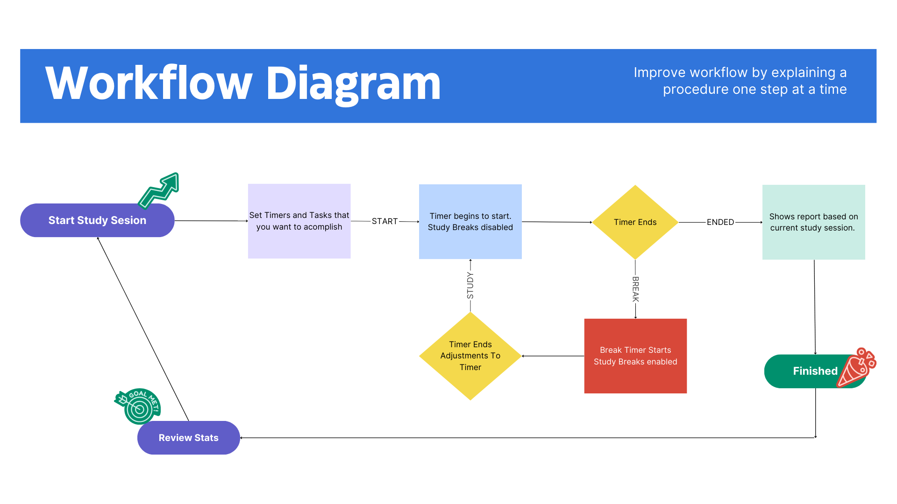
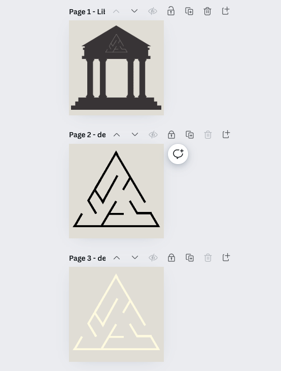

# Conceptual Library

- **Team Members**: 
	- Spencer Damiano
- **Description of Project**: 

---

# Section 1: Introduction

## Purpose
The purpose of this project is to build a study WebApp using react for a frontend and .NET for backend. The first purpose that this will fill is to be the WebApp that I use to better optimize and record my personal study and work sessions. With the second being to gain experience with both react and .NET as these seem to be the most in demand technologies for jobs that I would like to work for.

## Scope
This project hopes to better utilize the Pomodoro technique which has helped many students and professionals. The application will implement tools such as customizable timers, music, background sounds, break reminders, todo and distraction lists, and study break games and meditations. This site will only be hosted locally and interact with a SQL Light file to use as a database. This will focus primarily on the design and implementation on the frontend tools into a full stack application.

## Overview
The Pomodoro Timer Application is a productivity tool designed to help users manage their time effectively using the Pomodoro Technique. The technique involves breaking work into intervals, traditionally 25 minutes in length, separated by short breaks. this will be implement along with a flowmodoro timer which is a stopwatch that counts up and then sets a break based on time worked. This application will allow users to customize their work and break intervals, manage their tasks, and track their productivity over time. The application will feature a user-friendly web interface. The backend will handle user authentication, data storage, and task management, ensuring a seamless user experience. The application will also provide insights and analytics to help users understand and improve their work habits. The project aims to deliver a high-quality, reliable, and intuitive tool to enhance user productivity.

## User Profiles
The plan is to implement a user profile with a potential manager profile.
- User
	- These users are primarily high school and college students looking to manage their study sessions more effectively. They need features such as task management, customizable timer settings, and productivity tracking to balance their academic responsibilities with breaks and leisure activities.
- Manager
	- This profile is able to assign tasks to users. They would only be able to see amount of time worked on that task and it's status. Managers would not be able to see all tasks that a student does or total amount of time on the task. An even further stretch goal would be to allow Users to send reports to Managers based on their tasks.

## Workflows
This is based on a user interaction not Architecture

### Standards
- **Coding**:  Follow [google typescript guid](https://google.github.io/styleguide/tsguide.html),  [Microsoft's c# conventions](https://learn.microsoft.com/en-us/dotnet/csharp/fundamentals/coding-style/coding-conventions), and [Mozilla SQL Style guide](https://docs.telemetry.mozilla.org/concepts/sql_style). 
- **Design**: Follow user-centered design principals. This will help make simple features that are intuitive to use
- **Learning Model**: This will follow Agile Development, using my accountability partner and the weekly reports as measures for my accountability.
- **Architecture**: The front end will be built using React, providing a dynamic and responsive user interface. It will communicate with the backend via RESTful APIs. The backend will be developed with .NET, handling business logic, user authentication, and task management. It will expose RESTful APIs for the front end and ensure data validation. SQLite will be used for the database, storing user profiles, tasks, and session information. Entity Framework Core will facilitate interactions between the .NET backend and the SQLite database.
- **Quality Assurance Characteristics and Metrics**: Quality assurance will be conducted through a combination of automated testing and manual testing. I will use unit tests, integration tests, and end-to-end tests to ensure the correctness and robustness of the application.
- **Legal & Security Risks**: The application will use HTTPS to encrypt data in transit and secure storage mechanisms for data at rest. I will also conduct regular security audits and vulnerability assessments to identify and mitigate potential risks.

---

# Section 2a: Requirements

1. Study States
	- **Description**: This is an internal measure key to the success of the app. Getting this right will determine the success of this project and deserves it's own requirement to get right
	- **Success Measurement**:
		- Able to be changed by the timer feature and also on special conditions
		- Is checked for various features granting permissions (such as study break games)
		- Also helps dictate when and how things are sent in the database to allow for a smooth running app.
1. SQLite Database
	- **Description**: This is a simple database used to host user information
	- **Success Measurement**:
		- Uses a simple login to track users
		- Store study session information for users
		- Meets Boyce-Codd Normal Form requirements.
1. Timer Function
   - **Description**: Pomodoro and Flowmodoro timers implemented with no known bugs 
   - **Success Measurement**:
	   - Pomodoro
		   - Timers have both preset and custom timers for users to pick through
		   - These timers are recorded in the database
		   - Correctly set study states
		   - sound when the study and break timer are up
	- Flowmodoro 
		- Stopwatch works with variable study markers to signal time elapsed and sounds when study breaks are up
		- Has break rules of not allowing a break before 5 minutes and forces a break at 90 minutes
		- Study times recorded in database.
		- Correctly sets study states
2. Todo and Distraction List 
   - **Description**: Has two todo like lists that are recorded in database to aid in studying
   - **Success Measurement**: 
	   - Todo List
		   - Connected to database
		   - Mark tasks as in progress, set priority, and mark as done
		   - Reports what tasks were created during studying
	- Distraction list
		- Connected to database
		- Delete tasks as done or move them to the todo list
		- Not visible during the 'study' part of the study state but are able to add them to the list
3. Study Music and Soundscapes
	- **Description**: Have types of royalty free music and soundscapes available for study. 
	- **Success Measurement**:
		- Dopamine Protecting feature where music and sound will tapper off at certain percentages of your study session to avoid dopamine overload.
		- Control level of volume for both music and sounds
		- record percentage of time listening to music and at what percentages.
4. Study Reports
	- **Description**: This will display a record of pervious study sessions so users can look at their data to determine their best study patterns.
	- **Success Measurement**:
		- Simple webpage connected to their user profile that shows pervious study sessions
		- Marked by day, time, tasks completed, distract lists. Possible more features that will be used in the stretch requirements.

---

# Section 2b: Stretch Requirements

1. Break Games and Meditations  
   - **Description**: While in a 'break' state be able to access simple low dopamine games or meditations to help you study. 

2. Markdown Report
   - **Description**:  This would be a downloadable markdown file that could be used in apps like Notion or Obsidian. This would allow users to use different features of these apps to track their study data. This would show the same information as displayed on their user profile

3. AI breakdown of study sessions
	- **Description**: Using Python create a simple model that takes in data points such as time of day, tasks completed, distractions list size, to help student recognize their own study patterns.

4. API Study Tool Usage
	- **Description**: This would be to simply use an API for a feature. The hope is to get the Canvas API so students could add assignments as their todo tasks and track how long they spend on classes. I have some backups as I've heard the Cavas API can be tricky
	- *Backups*
		- ChatGPT
		- Spotify
		- Google Drive (add study reports)
		- Notion API
		- Login API's (Google, Apple, etc)

---

# Section 3: Design Overview of the Product

## Workflow
- Landing Page
	- This will be a page that asks you to login. If a user does not want to login then none of their data will be stored in the database.
- Login (optional)
	- This is the login for using the database. There might be an API login through a third party and that would go here as well. 
- Study Session
	- This will be where the study tools will be located. The design and wireframes for this are attached below
- Results Page
	- This will be a simple screen that will overlay over the Study Session page and give you the stats for that given study page
- User Page
	- This will have a store of all your pervious study sessions and give basic user total stats (total hours, tasks, average study session, streaks). 

## Resources
- IDE: Visual Studio Code
- AI Tools:
	- Chat GPT 4o
	- GitHub Copilot 
- Other Software:
	- SQLite Database
	- GitHub
	- GitHub Desktop
	- Canva
- Potential APIs
	- Canvas
	- Google
	- Notion
	- Spotify

## Data at Rest
- Store non-sensitive information such as timer settings, tasks, and productivity stats. Also potentially game high scores.

## Data on the Wire
- Build stored data around non-sensitive information to allow for minimal security requirements.
- Focus on functionality and usability without complex security protocols.
- Maintain basic HTTP methods for data transmission to allow for proper communication to the database.

## Data State
- Utilize React state management to handle changes in the user interface based on user interactions, such as starting or stopping a timer, updating tasks, and switching between application modes.
- Implement simple state transitions that reflect the user's current interaction phase, such as "Study", "Break", and "Settings".
- Ensure that state changes are predictable and managed centrally wherever possible to ease debugging and future enhancements.

## HMI/HCI/GUI
- ### HMI/HCI
	- **Goals**:
		- Ensure the application is user-friendly and accessible, allowing users to interact with the app effectively.
		- Optimize user interactions to enhance productivity and minimize cognitive load, leveraging best practices in HCI design.
		
	- **Requirements**:
		- The application should have clear and consistent navigation structures to ensure ease of use.
		- Interactive elements such as buttons, forms, and links should be designed with accessibility in mind (e.g., adequate size for touch interactions, high contrast for visibility).
		- User input should be validated in real-time to provide immediate feedback on errors or confirmation of successful actions, enhancing user satisfaction and preventing frustration.
		- Implement responsive design principles so that the application can be effectively used across different devices and screen sizes, including tablets and mobile phones.

- ### GUI

	- **Goals**:
		- Create a visually appealing interface that encourages engagement and long-term usage.
		- Implement a design that reflects the functionality of the app, making it intuitive for users to understand how to use various features without extensive instruction.

	- **Requirements**:

		- Use a consistent color scheme and typography that align with the intended user base's preferences and the psychological effects desirable for a study aid (e.g., calming colors like blues or greens, clear, readable fonts).
		- The main dashboard should display all primary features (timer, task list, productivity reports) in a central, easy-to-navigate layout.
		- Design interactive elements such as customizable timers and todo lists to be user-centric, allowing users to interact with the application with minimal clicks or taps.
		- Include tooltips, onboarding tutorials, and help sections within the application to aid new users in learning how to use various features effectively.

### Diagrams and Tables

Need to add database design and better workflow chart. That is part of this weeks goal

---

# Section 4: Verification

## Demo
The application will be demonstrated through a series of user scenarios to validate all functionalities as designed. This includes demonstrating user registration, session management, task handling, and report generation. A live demonstration will be conducted to show the application’s responsiveness and performance under typical usage conditions.

## Testing
1. **Study States Testing**  
   - **Verification Method**: Manuel and automatic testing to simulate different study and break intervals, ensuring the state transitions are handled correctly.
   - **Criteria**: All state transitions must occur correctly in less than 1 second without errors in 99% of test cases.

2. **SQLite Database Testing**  
   - **Verification Method**: Perform integration testing to verify that all CRUD operations interact with the database as expected, using test cases that simulate real user interactions.
   - **Criteria**: Database operations must complete with correct outputs and without any exceptions in 95% of test cases.

3. **Timer Function Testing**
   - **Verification Method**: Manual testing and automated scripts to ensure timers initiate, pause, and end correctly, and that notifications and alerts function as intended.
   - **Criteria**: Timers must function accurately within a margin of error of ±1 second after user input.

---

# Sources/Citation/Resources Links
- Google TypeScript Guide: [https://google.github.io/styleguide/tsguide.html](https://google.github.io/styleguide/tsguide.html)
- Microsoft C# Conventions: [https://learn.microsoft.com/en-us/dotnet/csharp/fundamentals/coding-style/coding-conventions](https://learn.microsoft.com/en-us/dotnet/csharp/fundamentals/coding-style/coding-conventions)
- Mozilla SQL Style Guide: [https://docs.telemetry.mozilla.org/concepts/sql_style](https://docs.telemetry.mozilla.org/concepts/sql_style)
- React Documentation: [https://reactjs.org/docs/getting-started.html](https://reactjs.org/docs/getting-started.html)
- .NET API Documentation: [https://docs.microsoft.com/en-us/dotnet/api/](https://docs.microsoft.com/en-us/dotnet/api/)
- SQLite Documentation: [https://www.sqlite.org/docs.html](https://www.sqlite.org/docs.html)
- Entity Framework Core Documentation: [https://docs.microsoft.com/en-us/ef/core/](https://docs.microsoft.com/en-us/ef/core/)
